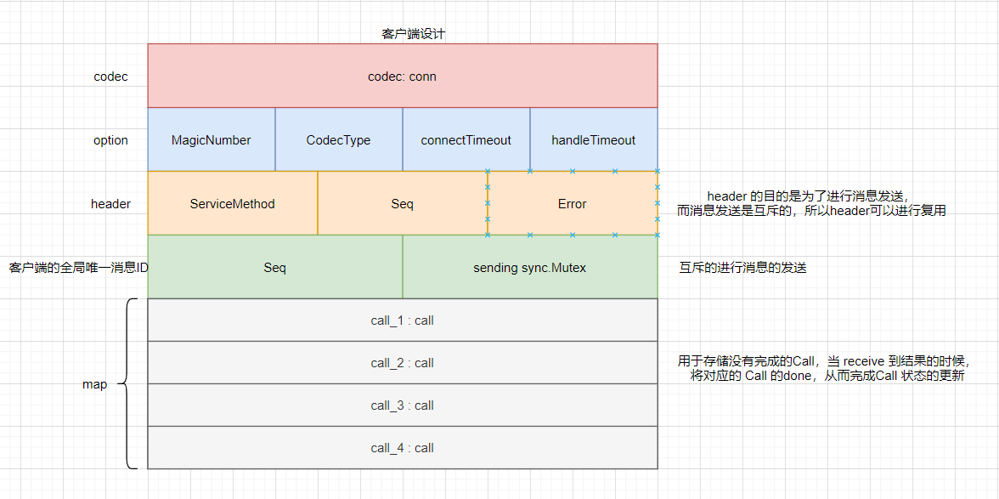
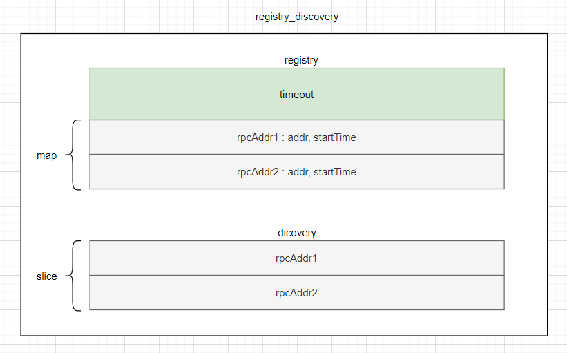
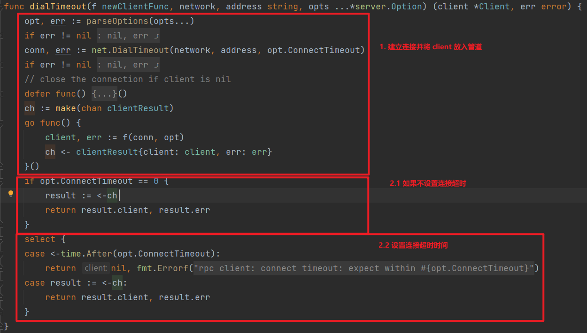

## 通信消息格式设计

- MagicNumber ： cafebabe，用来验证是否是正确的 RPC 消息格式协议
- CodecType ：用来协商编码格式
- connectTimeout ：用来协商连接超时时间
- handleTimeout ：用来协商服务端处理超时时间
- msg ： header + body

## 服务端设计

### 请求格式

### service 

- name : 服务的名称
- type ： 服务的类型
- rcvr ：服务值
- map ：方法和对应方法的调用

## server

- map ： 服务名字和对应的服务 --> "foo" : *Service

## 客户端设计

### call

- call = request + done

### client

### xclient 

- option 用来协商
- 内部封装一个注册中心，方便获取 rpc 地址
- selectMode 用来做负载均衡策略

## 注册中心设计

## RPC 调用流程

## 项目实现

### 超时处理机制

我们把超时分为俩种，连接超时和处理超时。

对于客户端的连接和服务端处理超时，我们将超时的设置放在Option中，默认连接超时时间是 10s，处理超时时间设置为0，也就是不限制。对于客户端和服务端的连接超时处理，我们需要在建立连接的时候外加一层包装，使用 select 和 管道来判断是否发生了超时。 处理超时和连接超时的处理方法类似，在服务端处理请求的时候加入超时处理逻辑，也是使用select 和 time.After 进行实现的。

1. 客户端连接超时处理

2. 客户端调用超时处理

3. 服务端处理超时处理

### 心跳机制

### 负载均衡

负载均衡时建立在服务发现的基础之上，负载均衡是在可用的服务之中根据不同的策略选择一个服务实例，常见的选择策略有轮询、加权轮询、hash算法、随机选择算法等。

在用户发起调用的时候，传递给注册中心指定的负载均衡算法，注册中心根据指定的负载均衡算法从所有可用的服务实例中挑选一个可用的服务实例地址返回，然后客户端和这个服务实例进行建立连接进行远程调用。

